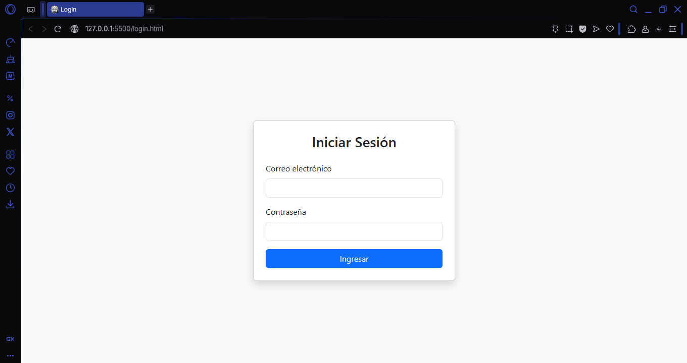
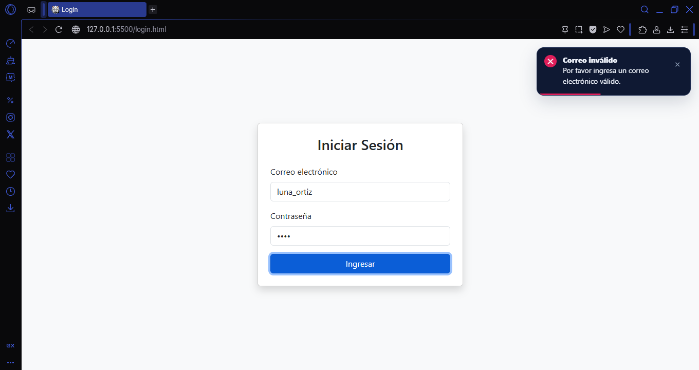
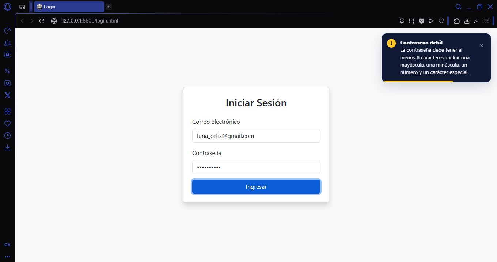
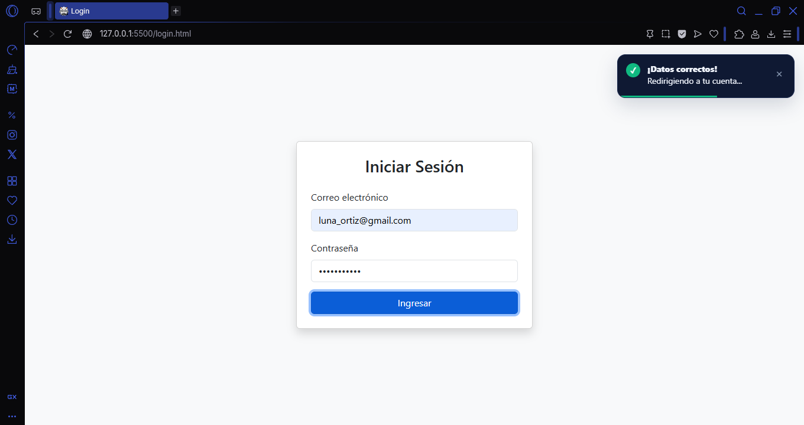
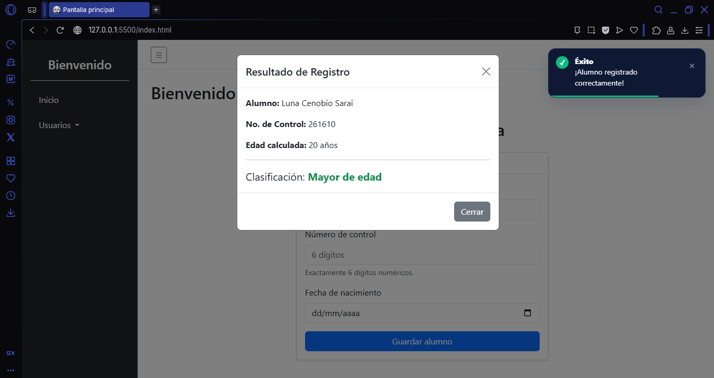
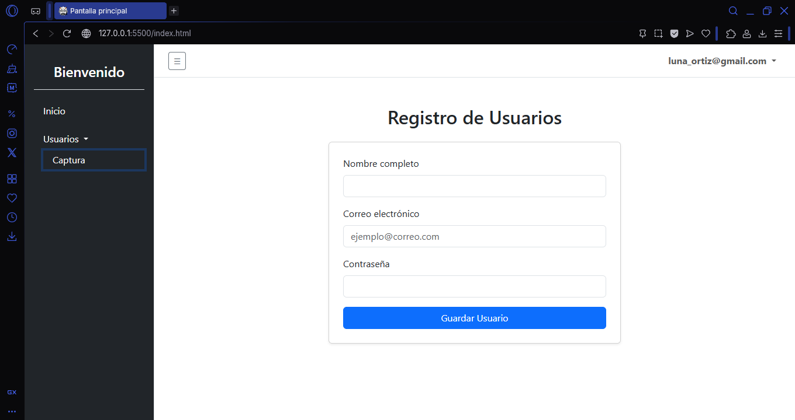
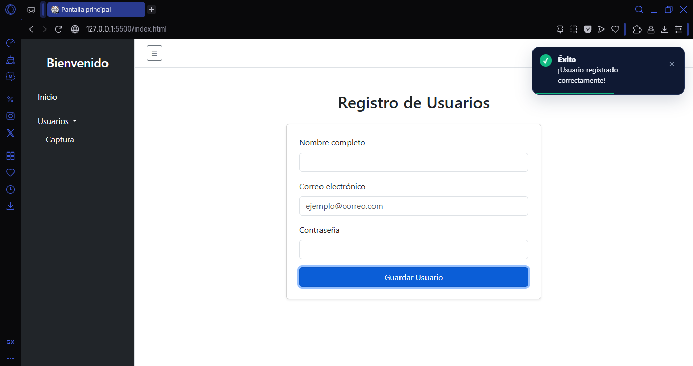
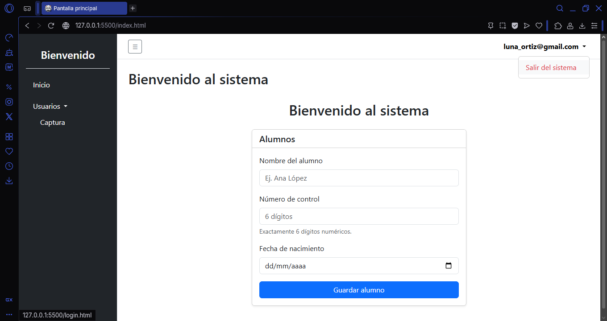

# Proyecto: Sistema de Login y Panel de Control

**Repositorio:** <https://github.com/gaelfernando201579-netizen/login_parejas>

**GitHub Pages (Demo en vivo):** <https://gaelfernando201579-netizen.github.io/login_parejas/login.html>

## Tabla de Contenido

- [Integrantes del Equipo](#-integrantes-del-equipo)
- [Descripción Breve](#-descripción-breve)
- [Estructura del Proyecto](#-estructura-del-proyecto)
- [Explicación y Documentación Técnica](#️-explicación-y-documentación-técnica)
- [Proceso de Creación (Paso a Paso)](#️-proceso-de-creación-paso-a-paso)
- [Capturas de Pantalla del Flujo](#-capturas-de-pantalla-del-flujo)

## Integrantes del Equipo

- Gael Fernando Ortíz Pérez
- Sarai Luna Cenobio

## Descripción Breve

Este proyecto es una simulación frontend de un sistema de acceso seguro. Consta de dos pantallas interconectadas: una página de inicio de sesión (`login.html`) que valida las credenciales del usuario, y un panel principal (`index.html`) que incluye navegación dinámica (navbar y sidebar), formularios de captura de datos validados, y componentes interactivos como modales.

## Estructura del Proyecto

El repositorio está organizado de la siguiente manera para separar la lógica, los estilos y la estructura:

```text
📁 login_parejas
├── 📄 index.html        # Pantalla del sistema principal (Panel de control)
├── 📄 login.html        # Pantalla de acceso
├── 📄 README.md         # Documentación del proyecto
├── 📁 css
│   └── 📄 componente.css     # Estilos personalizados
├── 📁 img
│   └── 🖼️ captura_correcto.png     # Captura del flujo
│   └── 🖼️ captura.png     # Captura del flujo
│   ├── 🖼️ image.png     # Icono de la página web
│   ├── 🖼️ index_alumnos.png     # Captura del flujo
│   └── 🖼️ index.png     # Captura del flujo
│   ├── 🖼️ login_contra.png     # Captura del flujo
│   └── 🖼️ login_correo.png     # Captura del flujo
│   ├── 🖼️ login_valido.png     # Captura del flujo
│   └── 🖼️ Login.png     # Captura del flujo
│   ├── 🖼️ salir.png     # Captura del flujo
└── 📁 js
    ├── 📄 componente.js      # Lógica de validación, inicio y cierre de sesión
```

## Explicación y Documentación Técnica

### Framework CSS Utilizado

Para el diseño y la maquetación de este proyecto utilizamos **Bootstrap**. Elegimos este framework porque nos proporciona clases utilitarias robustas para estructurar el _grid_, estilizar los formularios rápidamente y hacer uso de componentes preconstruidos e interactivos como el **Modal**, el **Navbar** con _dropdown_ y el menú tipo hamburguesa.

### Flujo de Login hacia el Sistema

1. El usuario ingresa a `login.html`.
2. Se capturan los datos de correo y contraseña en el formulario.
3. Mediante JavaScript, se intercepta el evento `submit` para evitar que la página se recargue.
4. Se ejecutan las funciones de validación. Si ambas son correctas, se simula el acceso redirigiendo al usuario mediante `window.location.href = 'index.html';`.

### Traspaso del Nombre de Usuario (De Login a Navbar)

Para mantener la "sesión" activa entre dos páginas HTML distintas sin usar un backend, utilizamos la API de Web Storage, específicamente `localStorage`:

- **En `login.html`:** Tras una validación exitosa, guardamos el correo/usuario ingresado usando `localStorage.setItem('usuarioActivo', inputCorreo.value)`.
- **En `index.html`:** Al cargar la página, un script lee este valor con `localStorage.getItem('usuarioActivo')`. Si existe, inyecta ese texto en el elemento del Navbar correspondiente. Si no existe, redirige de vuelta al login para proteger la ruta.
- **Al Salir:** El botón "Salir del sistema" ejecuta `localStorage.removeItem('usuarioActivo')` y regresa a `login.html`.

### Métodos Principales Utilizados

Se integró la librería `utileria.js` para estandarizar procesos. Los métodos clave son:

- `validarCorreo(email)`: Verifica mediante expresiones regulares que la cadena tenga el formato correcto (`texto@dominio.com`).
- `validarPassword(password)`: Asegura que la contraseña cumpla con los requisitos mínimos de seguridad establecidos.
- `validarNumeroControl(numero)`: Método implementado para verificar que el campo tenga exactamente una longitud de 6 dígitos numéricos.

## Proceso de Creación (Paso a Paso)

### 1. Armado del Login y Validaciones

Comenzamos estructurando `login.html` con Bootstrap para el formulario. En `login.js`, capturamos los inputs y usamos los métodos de `utileria.js` para asegurar que el correo y contraseña no estuvieran vacíos y tuvieran formato válido. Una vez validados, guardamos el correo en `localStorage` y redirigimos.

### 2. Estructura del Navbar y Sidebar

En `index.html` construimos la interfaz del sistema.

- **Navbar:** Agregamos una barra superior con un menú desplegable (_dropdown_) alineado a la derecha para las opciones de usuario.
- **Sidebar:** Maquetamos un panel lateral con la opción "Usuarios" que despliega un submenú "Captura". Añadimos un botón de hamburguesa para colapsar/expandir este panel en pantallas pequeñas.

### 3. Recepción del Usuario en el Navbar

Creamos un script al inicio de `index.html` que verifica si hay un usuario en el `localStorage`. Seleccionamos el elemento del DOM en el Navbar destinado para el nombre y reemplazamos su contenido (`innerText`) con el correo recuperado. Añadimos el evento _click_ al botón de cerrar sesión para limpiar el Storage.

### 4. Formulario de Captura y Número de Control

Dentro del área de contenido principal, diseñamos el formulario de alta de alumnos. Añadimos el campo "Número de Control". En JS, le asignamos un evento para validar en tiempo real o al hacer submit que la entrada contenga exactamente 6 caracteres y que estos sean estrictamente numéricos.

### 5. Modal de Edad

Agregamos un campo para ingresar la fecha de nacimiento (o edad directa). Al presionar el botón de calcular/guardar, un script evalúa si el valor corresponde a alguien mayor o menor de 18 años. Dependiendo del resultado, disparamos dinámicamente un Modal de Bootstrap mostrando el mensaje correspondiente ("El alumno es mayor de edad" / "El alumno es menor de edad").

## Capturas de Pantalla del Flujo

**1. Pantalla de Acceso (Login)**








**2. Panel Principal con Formulario de Alumnos**


**3. Modal de Mayor/Menor de Edad funcionando**


**4. Formulario de Usuarios**




**5. Dropdown del Navbar y Cierre de Sesión**

